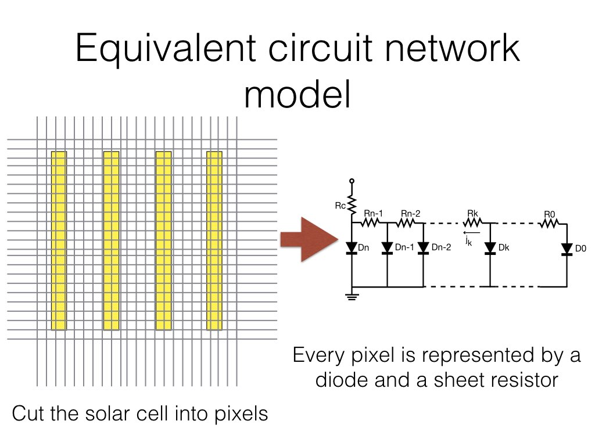

# Circuit network simulation of solar cells

This repository demonstrates how to use solcore5 and ngspice to simulate solar cell in 2D or 3D. The algorithm and the code is partly adapted from [Solcore](https://github.com/dalonsoa/solcore5), but I added a number of my own tweaks. Details are described [here](./docs/calculation_principles.md).

## Model

A brief description of the model is [here](./docs/calculation_principles.md). PDF version is [here](./docs/calculation_principles.pdf).

## Definition of resistances

The program calculates the value of resistors in each pixel.
- Resistance of back contact: R_back=max(R_back, 1e-16)
- r_{series}=R_{series}/(areal pixel)/gn
- Sheet resistance (ohm/ sq)
- rs_{top} = Rs_{top}/gn
- rs_{bot} = Rs_{bot}/gn
- rho=R*A/l=R*(w*h/l), A is area of cross section, w and h are width and height of the cross-section, respectively, and l is the length of the cable. rho is conductivity
- r_contact=R_{contact}/(Lx*Ly)/gn
- the minimal resistance is 1e-16.

## Known issues

- Simulation of three-junction cell does not work yet.
- Pixels larger than 50x50 takes time to run and becomes very numercially unstable.
Some proper approximation is required to deal with very fine fingers.

## Installation

Read [this guide](./install.md) for how to install this package.

## Other resources

- [Official github site of solcore5](https://github.com/dalonsoa/solcore5)
- [Documentation and tutorials of solcore5](http://docs.solcore.solar/en/master/)
- [NGSpice](http://ngspice.sourceforge.net/)

### Resources of learning python

- [Google's python course](https://developers.google.com/edu/python/)

### Jupyter Notebooks

- [Jupyter Notebook Basics](http://nbviewer.jupyter.org/github/jupyter/notebook/blob/master/docs/source/examples/Notebook/Notebook%20Basics.ipynb)

### License

GPLv3
