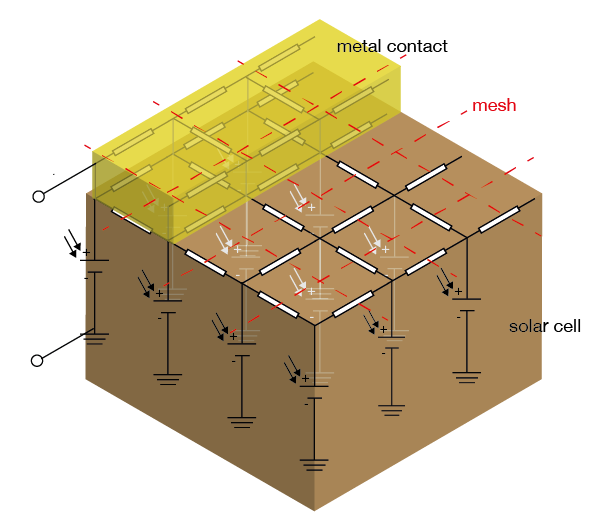

# Circuit network simulation of solar cells

This is a 3D multi-junction solar cell modeling software. This model cuts the software into small "pixels" and model each pixel as a small solar cell. This is shown in the below figure:



The scientific paper accompanied with this work has been published at [IEEE Access](https://doi.org/10.1109/ACCESS.2019.2930002).

## How to run this software

### Instructions of installation
See [install.md](./install.md) for how to install.

### Run in on CodeOcean (You only need a web browser to run the code)

This repository is mirrored on [CodeOcean](https://codeocean.com/capsule/9504942/tree/v1), where you can view and run [network simulation starter.ipynb](./network simulation starter.ipynb) to see this software work in action, without the need of installing python and other packages.

## Package dependency

You have to install [pypvcell](https://github.com/kanhua/pypvcell) before running this package. See this [installation guide](./docs/install.md) for details.

## Description of the model

The scientific paper accompanied with this work has been published at [IEEE Access](https://doi.org/10.1109/ACCESS.2019.2930002).

## Reproduce the results

Run [```run_demo_suites.sh```](./run_demo_suites.sh) to reproduce the figures on the paper.


## Installation

Read [this guide](./docs/install.md) for how to install this package.


## Basic usage

Check out [network simulation starter.ipynb](network simulation starter.ipynb) for how to use this package.


## Other resources

- [NGSpice](http://ngspice.sourceforge.net/)


### Resources of learning python

- [Google's python course](https://developers.google.com/edu/python/)
- [Jupyter Notebook Basics](http://nbviewer.jupyter.org/github/jupyter/notebook/blob/master/docs/source/examples/Notebook/Notebook%20Basics.ipynb)


### Acknowledgements

The codes that interfaces python and ngspice are adapted from [Solcore](https://github.com/dalonsoa/solcore5).

### License

GPLv3
