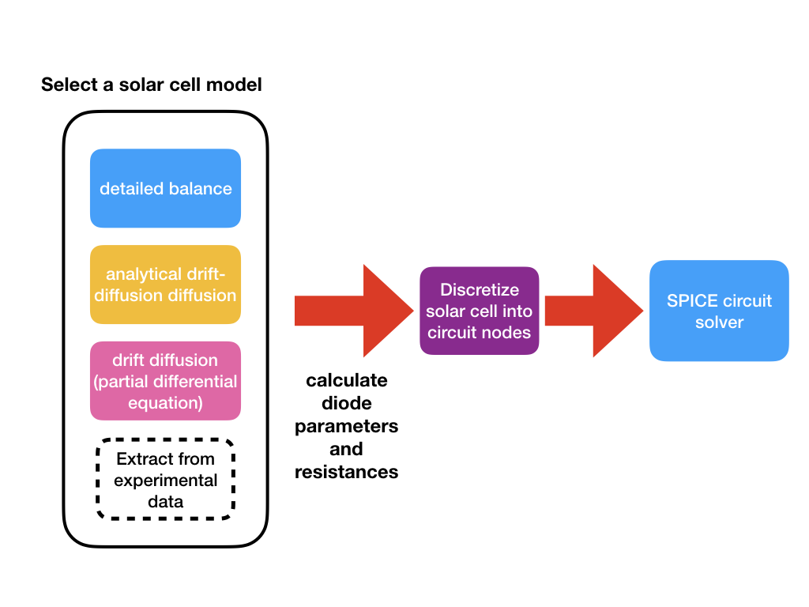
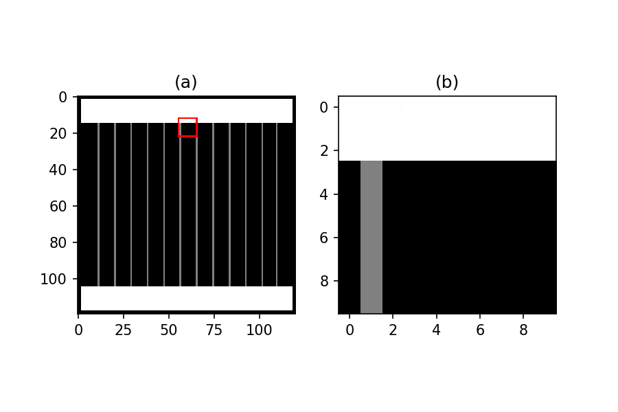
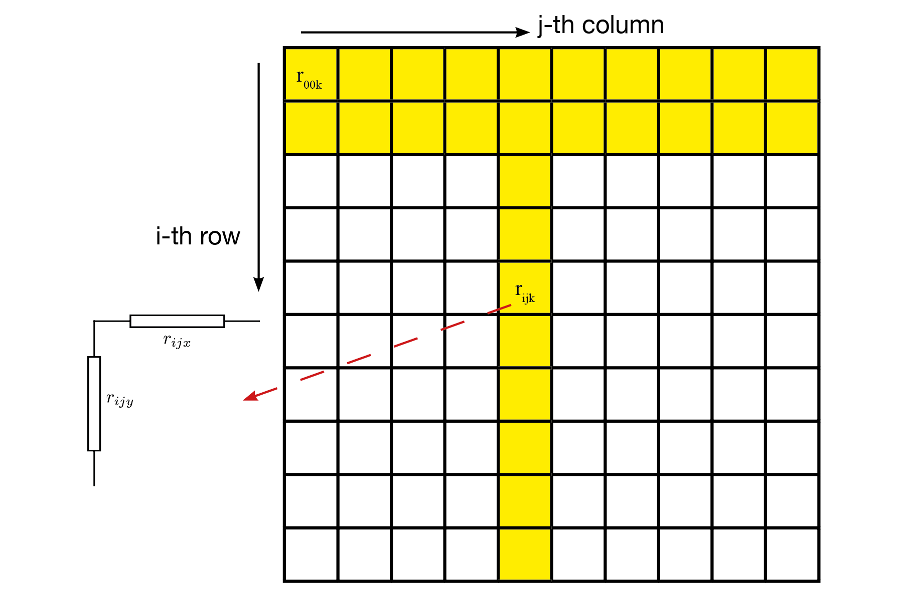

## Overview of the model

The overall modeling flow of this model is illustrated in the following chart:

To start with, the user should select a solar cell model of their choice. The default one in the demonstration code is **detailed balance model**. Details of the suppporte solar cell models can be found in [the white paper](https://link.springer.com/article/10.1007%2Fs10825-018-1171-3) of solcore5 or its [officical documentation](http://docs.solcore.solar/en/master/Solvers/solving_solar_cells.html) on the web. A solar cell model should then give the diode parameters, resisatnce values and the injection current for feeding into the equivalent circuit.

After that, the program discretizes the solar cell into small pixels, and each pixel is represented by a small circuit unit that contains two diodes, one current source and a number of resistors. Detailed procedure of the discretizaion is dscribed in [solcore5's ofiicial webpage](http://docs.solcore.solar/en/master/Quasi3D/quasi3D.html).

After the circuit network is built, the program feeds the generated circuitry file into the SPICE solver, and then calculates the I-V characteristics.

## Generalized discretization

A circuit solver essentially does $N \times N$ matrix inversion, where $N$ is the number of nodes in the circutry. The time complexity of solving matrix inversion is typically between $O(N^{2.3})$ to $O(N^{3})$[*](https://en.wikipedia.org/wiki/Computational_complexity_of_mathematical_operations). We therefore implemented an approximation algorithm to reduce the number of nodes but retain reasonable accuracy.

The above figure (a) shows an example of the front grid, whereas (b) is the enlarged image within the red square in (a). Our aim is to merge all the pixels in (b) into a single pixel. We then have to calculate the following parameters of this merged pixel:

- contact resisatnce
- metal grid resisatnce in x- and y-direction
- metal coverage (for calculating photon injection density)

In the meantime, the calculation the following parameter remain the same. Just be sure that the physical widths are that of merged pixel widths.

- sheet resistance
- diode parameters
- series resistance

### Metal grid resistance

Assume that the resistance in x- and y-direction of each pixel is $R_{ijx}$ and $R_{ijy}$. Our goal is to calculate the overall grid resisatnce $R_X$ and $R_Y$, as shown in the above figure.
The lumped resistance of the bus bar or the fingers in x-direction is calculated by simply applying the resistance superposition law:

$$
\begin{aligned}
R_{jx} &= \sum_{i=0}^{N_I-1} R_{ijx} \\
R_x &= \frac{1}{\sum_{j=0}^{N_J-1}\frac{1}{R_{jx}}} \\
\end{aligned}
$$

### Contact resistance

Contact resisatnce of the merged pixel is

$$
\begin{aligned}
R_c=\rho_c / \gamma_m
\end{aligned}
$$
where $\rho_c$ is contact resistivity ($\Omega \mbox{m}^2$) and $\gamma_m$ is the number of metal-grid pixels divided by the total number of pixels.

### Photon injection

The photon injection simply is

$$
\begin{aligned}
\phi_m=\phi_0 \cdot \gamma_m
\end{aligned}
$$

where $\phi_0$ is the original photon injection density.
