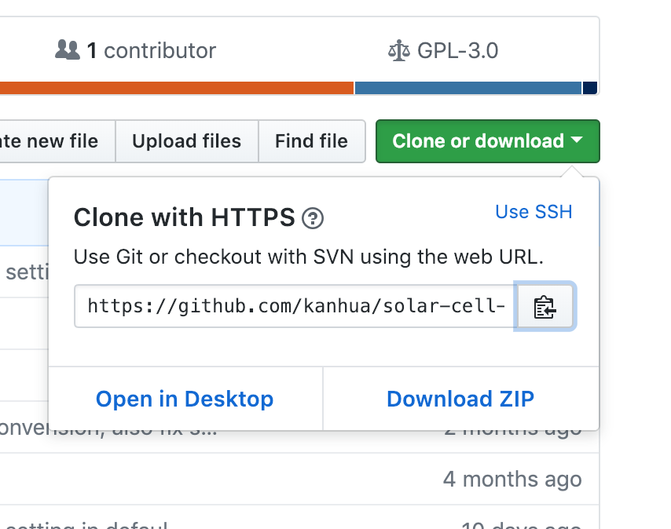

# How to install

## Prerequisites
Pypvcircuit needs the following software to work:

1. [Anaconda](https://www.anaconda.com/) or [Miniconda](https://conda.io/miniconda.html): A python language distribution made for scientific computing.
2. NGSpice: A circuit network library
3. Pypvcell: a python tool for solar cell

All the software will be installed in a folder of your choice.

## Install pypvcell

```bash
pip install git+git://github.com/kanhua/pypvcell
```


## Download pypvcircuit package

If you have git:

```bash
git clone https://github.com/kanhua/solar-cell-circuit.git

```

or you could just download the zip



## Run setup file

Run
```bash
python setup_spice.py SPICEPATH OUTPUTPATH

```


## Set PYTHONPATH

Include pypvcircuit project folder into your PYTHONPATH so that your program can find this program.
By project folder, we refer to the folder you unzipped from the downloaded zip file from github.
This folder is named of ```pypvcircuit-master```.
Add this into your ```PYTHONPATH```

In a unix like environment, run
```bash
export PYTHONPATH=$PYTHONPATH:"yourpath/to/pypvcircuit-master"
```

In windows you can do it by the following command in PowerShell:

```powershell

$Env:PYTHONPATH += ";your\path\to\pypvcircuit-master"

```


