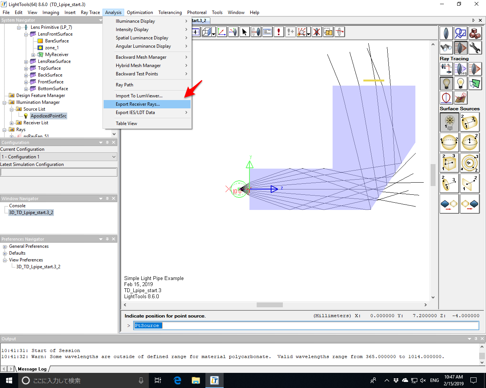
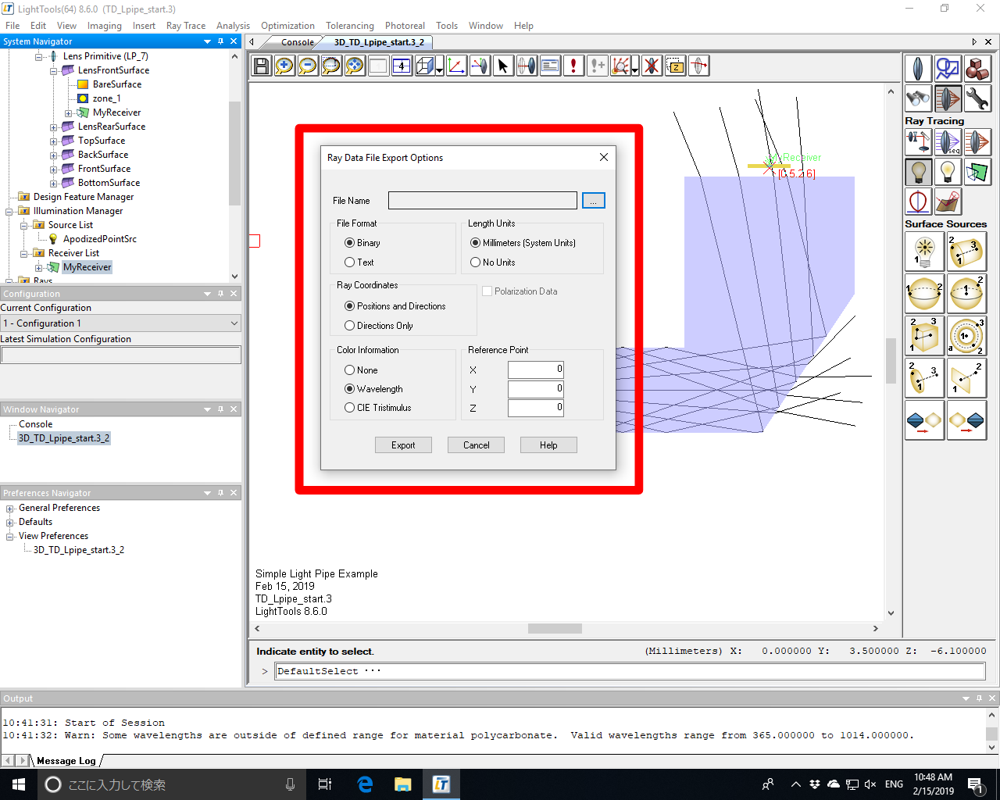

# Export the illumination from LightTools

This document describes how to export the ray data from LightTools that can be used as the input.

1. Select the receiver that you would like to output.
2. In Menu item, select Analysis -> Export Receiver Rays

3. In the Options form, select the file name and the following options:
  - File Format: Binary (the circuit network simulation program uses binary file as input, but you can also output another copy that has text format for your own record).
  - Length Units: Milimeters
  - Ray Coordinates: Positions and Directions
  - Color Information: Wavelength 
 

